# Automatic Door System - Setup Guide

A high-performance automatic door system using Unity ECS (Entities) with pooled audio and colliders for optimal performance with hundreds of doors.

---

## Table of Contents

1. [System Overview](#system-overview)
2. [Prerequisites](#prerequisites)
3. [Part 1: Creating Door Configurations](#part-1-creating-door-configurations)
4. [Part 2: Setting Up Door Prefabs](#part-2-setting-up-door-prefabs)
5. [Part 3: Adding Doors to Subscenes](#part-3-adding-doors-to-subscenes)
6. [Part 4: Main Scene Setup](#part-4-main-scene-setup)
7. [Part 5: Setting Up Door Identifiers](#part-5-setting-up-door-identifiers)
8. [Part 6: Player Setup](#part-6-player-setup)
9. [Part 7: Audio Configuration (Optional)](#part-7-audio-configuration-optional)
10. [Troubleshooting](#troubleshooting)

---

## System Overview

This door system uses:
- **Unity ECS** for efficient door state management and animation
- **Subscenes** for doors (better loading performance)
- **Object pooling** for audio sources and colliders (handles hundreds of doors)
- **Distance-based culling** to only activate nearby doors

### Architecture Diagram

```
SUBSCENE (ECS World)                    MAIN SCENE (MonoBehaviour World)
+---------------------------+           +----------------------------------+
| Door Prefab               |           | DoorManagement                   |
| - DoorAuthoring          |           | - BoxColliderPoolManager         |
| - DoorConfig (SO)        |  <---->   | - AudioSourcePoolManager         |
| - Door Meshes + Colliders |           | - DoorDataBridge                 |
| - TriggerVolume          |           | - DoorAudioBridge                |
+---------------------------+           +----------------------------------+
                                                      |
                                                      v
                                        +----------------------------------+
                                        | DoorIdentifier (per door)        |
                                        | - Links doorNumber to ECS door   |
                                        | - Audio configuration reference  |
                                        +----------------------------------+
```

---

## Prerequisites

- Unity 2022.3 LTS or newer
- Entities package installed
- Basic understanding of Unity's Subscene system

---

## Part 1: Creating Door Configurations

Door configurations are **ScriptableObjects** that define how a door behaves. Multiple doors can share the same configuration.

### Step 1.1: Create a DoorConfig Asset

1. In the **Project** window, right-click in your desired folder
2. Select **Create > AutomaticDoorSystem > DoorConfig**
3. Name it descriptively (e.g., `DoorConfig_DoubleRotating_90deg`)

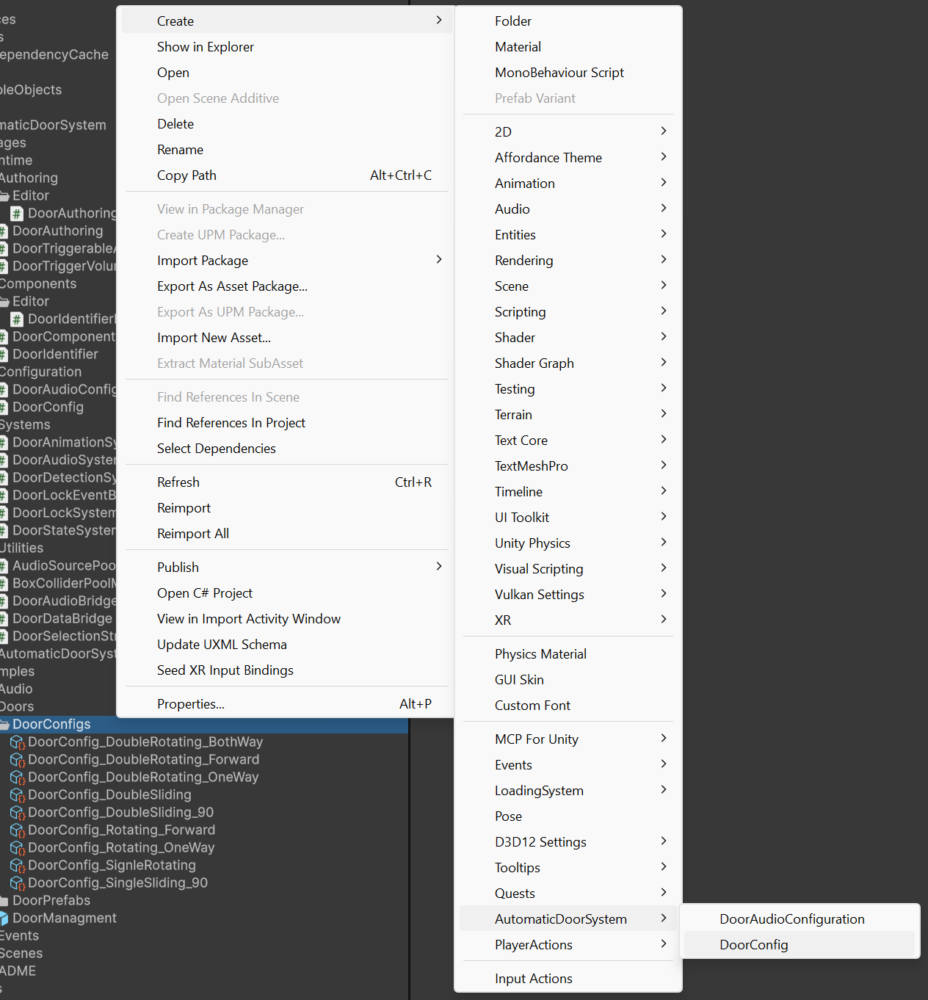
*Right-click > Create > AutomaticDoorSystem > DoorConfig*

### Step 1.2: Configure the DoorConfig

Select your new DoorConfig and configure it in the Inspector:

| Setting | Description | Recommended Values |
|---------|-------------|-------------------|
| **Door Movement** | `Rotating` or `Sliding` | Choose based on door type |
| **Door Count** | `Single` or `Double` | Single = 1 panel, Double = 2 panels |
| **Opening Style** | How double doors open | `Forward` (both away from player) |
| **Open Forward Angle** | Rotation when opening forward | `90` |
| **Open Backward Angle** | Rotation when opening backward | `-90` |
| **Slide Open Offset** | Distance to slide (sliding doors) | `(1.5, 0, 0)` |
| **Animation Duration** | How fast the door opens/closes | `1.0` - `1.5` seconds |
| **Auto Close Delay** | Time before auto-closing | `3.0` seconds |
| **Can Open Layer Mask** | Which layers can trigger doors | Select `Player` layer |
| **Start Locked** | Should door start locked? | Usually `false` |

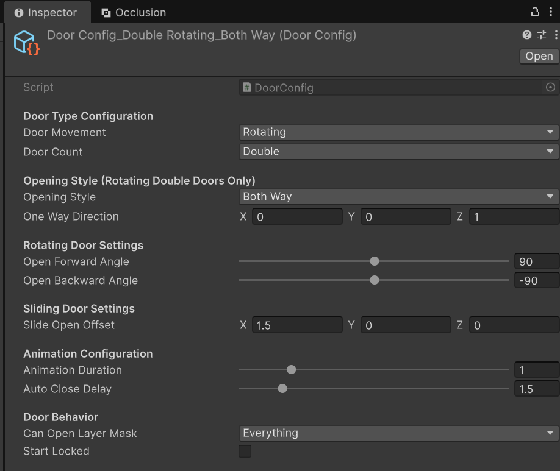
*DoorConfig Inspector with all settings visible*

---

## Part 2: Setting Up Door Prefabs

### Step 2.1: Create the Door Hierarchy

Create a new prefab with this exact hierarchy structure:

```
Door_DoubleRotating          <- Root GameObject (DoorAuthoring goes here)
  ├── LeftDoorMesh           <- Left door panel (mesh + BoxCollider)
  ├── RightDoorMesh          <- Right door panel (mesh + BoxCollider)
  └── TriggerVolume          <- Detection zone (DoorTriggerVolumeAuthoring)
```

For **single doors**, use this structure instead:
```
Door_SingleRotating          <- Root GameObject (DoorAuthoring goes here)
  ├── DoorMesh               <- Door panel (mesh + BoxCollider)
  └── TriggerVolume          <- Detection zone
```

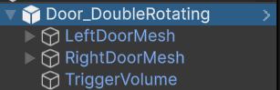
*Door prefab hierarchy in the Hierarchy window*

### Step 2.2: Set Up the Root GameObject

1. Select the root GameObject (e.g., `Door_DoubleRotating`)
2. Click **Add Component** and add **DoorAuthoring**
3. Configure the DoorAuthoring component:

| Field | What to Assign |
|-------|---------------|
| **Door Id** | Unique number for this door (e.g., `1`, `2`, `3`...) |
| **Door Mesh** | (Single doors only) Drag your DoorMesh here |
| **Left Door Mesh** | (Double doors) Drag LeftDoorMesh here |
| **Right Door Mesh** | (Double doors) Drag RightDoorMesh here |
| **Trigger Volume Object** | Drag TriggerVolume GameObject here |
| **Door Config** | Drag your DoorConfig asset here |
| **Enable Debug** | Check for gizmo visualization |

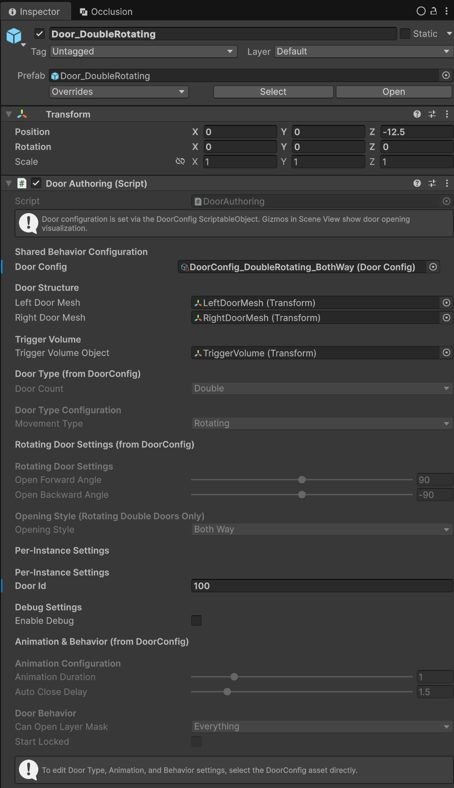
*DoorAuthoring component configured for a double door*

### Step 2.3: Add BoxColliders to Door Meshes

**Important:** BoxColliders on door meshes are essential for player collision!

1. Select each door mesh (e.g., `LeftDoorMesh`)
2. Click **Add Component > BoxCollider**
3. Adjust the collider to match your door's visual size:
   - Click **Edit Collider** button in the Inspector
   - Drag the green handles to fit the door mesh
   - Or manually set **Size** and **Center** values

**Typical values for a standard door:**
- **Size:** `(1.0, 2.2, 0.08)` (width, height, thickness)
- **Center:** `(0.5, 1.1, 0)` (offset from pivot)

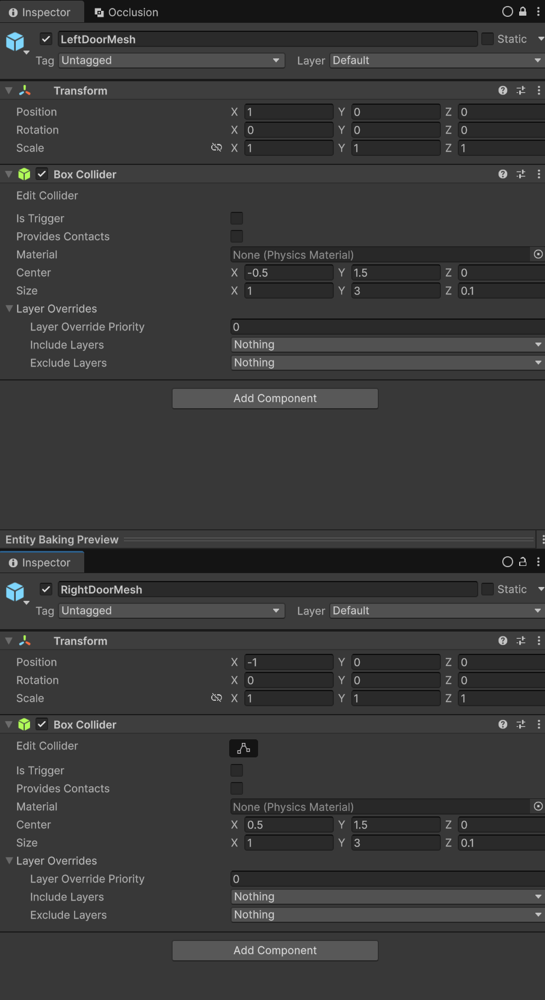
*BoxCollider on LeftDoorMesh with Edit Collider mode active*

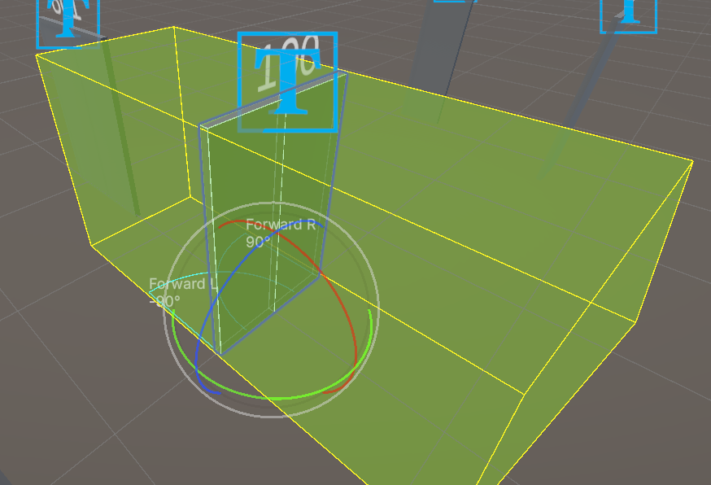
*Scene view showing the green BoxCollider outline on door meshes*

> **Note:** These colliders won't work directly in subscenes for physics. The system extracts their size/center during baking and applies them to pooled colliders at runtime.

### Step 2.4: Set Up the Trigger Volume

1. Select the `TriggerVolume` child GameObject
2. Add the **DoorTriggerVolumeAuthoring** component
3. Configure the detection zone:

| Field | Description | Recommended Value |
|-------|-------------|-------------------|
| **Volume Size** | Size of the trigger box | `(3.5, 3.0, 3.5)` |
| **Volume Center** | Center offset | `(0, 1.5, 0)` |

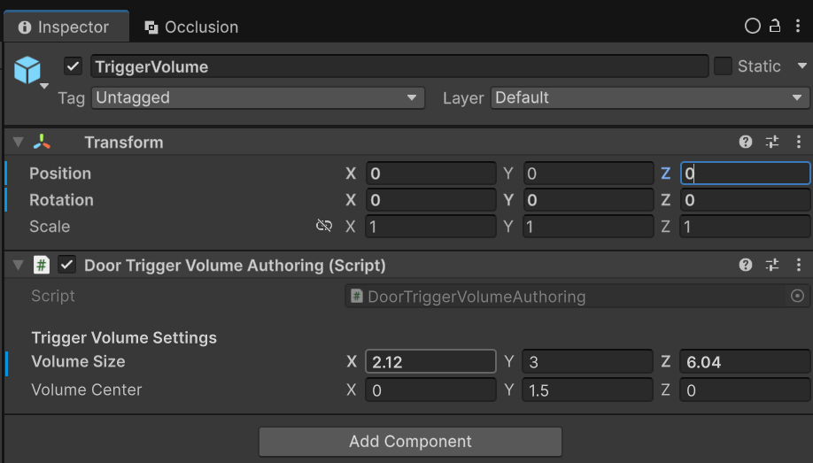
*DoorTriggerVolumeAuthoring component settings*

The trigger volume appears as a **green wireframe box** when selected in the Scene view.

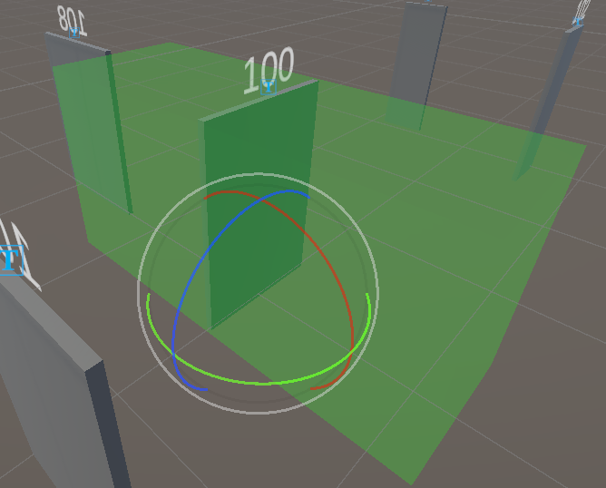
*Scene view showing the trigger volume gizmo*

### Step 2.5: Save the Prefab

1. Drag the root GameObject from Hierarchy to your **Project** window
2. Save it in a folder like `Assets/Prefabs/Doors/`
3. Name it clearly (e.g., `Door_DoubleRotating.prefab`)

---

## Part 3: Adding Doors to Subscenes

### Step 3.1: Create or Open a Subscene

1. In your scene, select **GameObject > New Sub Scene > Empty Sub Scene**
2. Name it (e.g., `Subscene_Building1_Doors`)
3. The subscene appears in the Hierarchy with a special icon

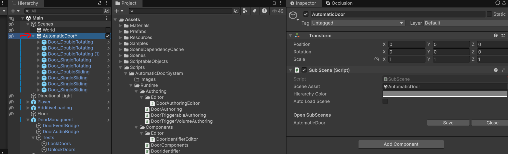
*Creating a new subscene*

### Step 3.2: Add Door Prefabs to the Subscene

1. **Double-click** the subscene to open it for editing (or right-click > Open)
2. Drag your door prefab from the Project window into the subscene
3. Position the door in your scene
4. **Important:** Set a unique **Door Id** for each door instance

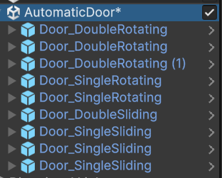
*Door prefab placed inside an open subscene*

### Step 3.3: Assign Unique Door IDs

Each door **must have a unique Door ID**. This ID links the ECS door to its MonoBehaviour DoorIdentifier.

1. Select the door in the subscene
2. In the DoorAuthoring component, set **Door Id** to a unique number
3. Write down or remember this number - you'll need it for the DoorIdentifier later

| Door | Door ID |
|------|---------|
| Entrance Door | 1 |
| Office Door | 2 |
| Storage Door | 3 |
| ... | ... |


*Multiple doors with unique Door IDs*

### Step 3.4: Close the Subscene

1. Right-click the subscene in Hierarchy
2. Select **Close**
3. The subscene will bake and convert to ECS entities

---

## Part 4: Main Scene Setup

The Main Scene contains the **DoorManagement** system that handles pooled resources.

### Step 4.1: Create the DoorManagement GameObject

1. In your **Main Scene** (not a subscene), create an empty GameObject
2. Name it `DoorManagement`
3. Position it at `(0, 0, 0)` - position doesn't matter, but keep it organized


*DoorManagement GameObject in the Main Scene hierarchy*

### Step 4.2: Add Required Components

Add these four components to the DoorManagement GameObject:

#### Component 1: BoxColliderPoolManager

**Purpose:** Creates pooled BoxColliders that follow door panels for physics collision.

| Setting | Description | Recommended Value |
|---------|-------------|-------------------|
| **Max Pool Size** | Maximum active colliders | `25` |
| **Culling Distance** | Range to activate colliders | `25` meters |
| **Distance Check Interval** | How often to update | `0.5` seconds |
| **Minimum Spacing** | Prevent duplicate colliders | `0.5` meters |
| **Reassignment Threshold** | Hysteresis for stability | `1.3` |
| **Keep Out Of Range Assignments** | Reduce reassignments | `true` |

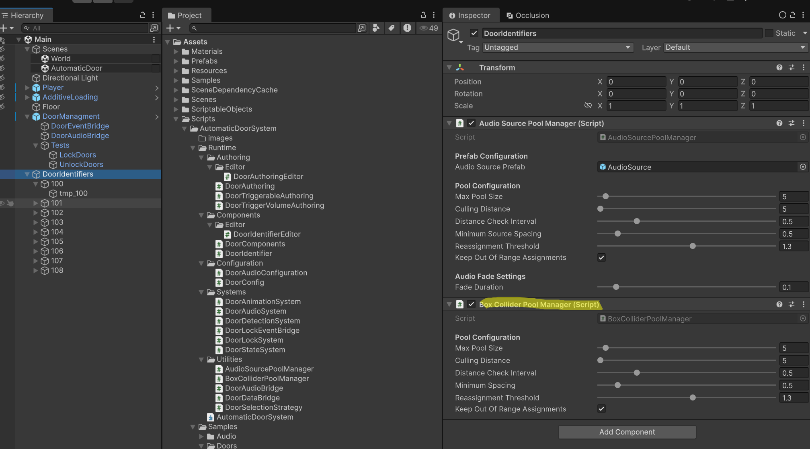
*BoxColliderPoolManager component settings*

#### Component 2: AudioSourcePoolManager

**Purpose:** Creates pooled AudioSources for door sounds (open, close, lock, unlock).

| Setting | Description | Recommended Value |
|---------|-------------|-------------------|
| **Audio Source Prefab** | Optional custom prefab | Leave empty for default |
| **Max Pool Size** | Maximum active audio sources | `25` |
| **Culling Distance** | Range to activate audio | `25` meters |
| **Distance Check Interval** | How often to update | `0.5` seconds |
| **Minimum Source Spacing** | Prevent overlapping sounds | `0.5` meters |
| **Reassignment Threshold** | Hysteresis for stability | `1.3` |
| **Keep Out Of Range Assignments** | Reduce reassignments | `true` |
| **Fade Duration** | Volume fade time | `0.1` seconds |

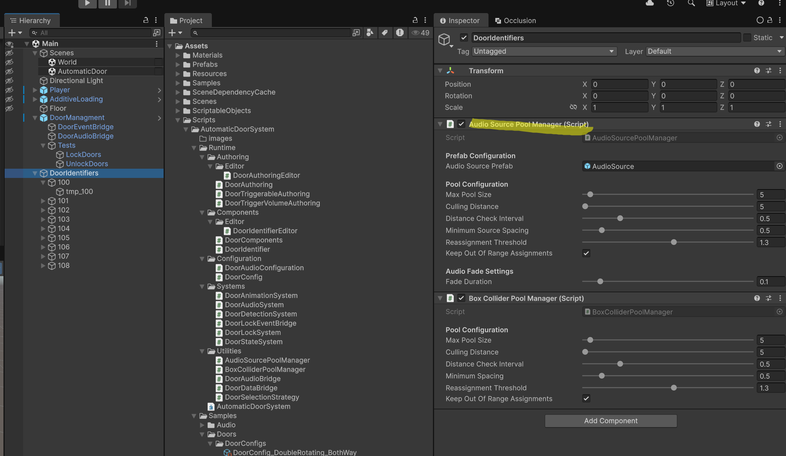
*AudioSourcePoolManager component settings*

#### Component 3: DoorDataBridge

**Purpose:** Bridges data between ECS doors and MonoBehaviour world. Caches door positions and states.

This component has no visible settings - just add it.

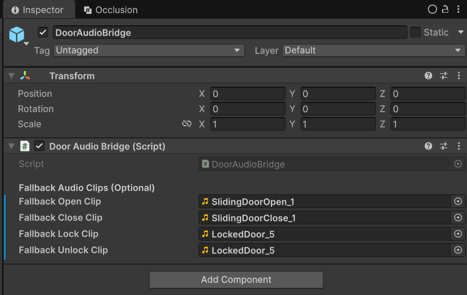
*DoorDataBridge component (no settings)*

#### Component 4: DoorAudioBridge

**Purpose:** Routes audio events from ECS to the pooled AudioSources.

This component has no visible settings - just add it.

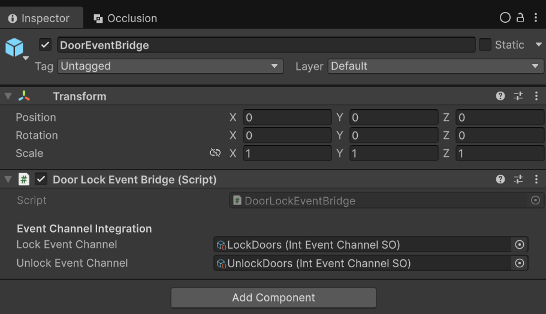
*DoorAudioBridge component (no settings)*

### Step 4.3: Verify DoorManagement Setup

Your DoorManagement GameObject should now have all 4 components:

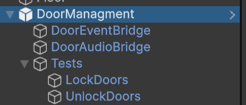
*Complete DoorManagement setup with all 4 components*

---

## Part 5: Setting Up Door Identifiers

**DoorIdentifier** components live in the **Main Scene** and link each door's audio configuration to its Door ID.

### Step 5.1: Create DoorIdentifier GameObjects

For **each door** in your subscenes, create a corresponding DoorIdentifier in the Main Scene:

1. Create an empty GameObject in the Main Scene
2. Name it `DoorIdentifier_[DoorID]` (e.g., `DoorIdentifier_001`)
3. Position it at the same location as the subscene door (approximate is fine)

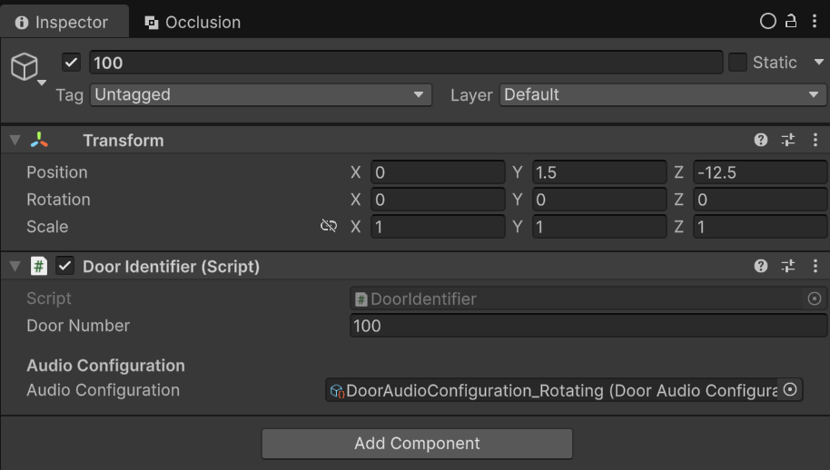
*DoorIdentifier GameObject created in Main Scene*

### Step 5.2: Add and Configure DoorIdentifier Component

1. Add the **DoorIdentifier** component
2. Configure these settings:

| Field | Description | Value |
|-------|-------------|-------|
| **Door Number** | **Must match** the Door ID in DoorAuthoring | Same as subscene door |
| **Audio Configuration** | Optional audio settings asset | Assign if using custom audio |


*DoorIdentifier component showing Door Number field*

### Step 5.3: Organize DoorIdentifiers

Create a parent GameObject to keep things organized:

```
DoorIdentifiers              <- Parent (empty GameObject)
  ├── DoorIdentifier_001
  ├── DoorIdentifier_002
  ├── DoorIdentifier_003
  └── ...
```

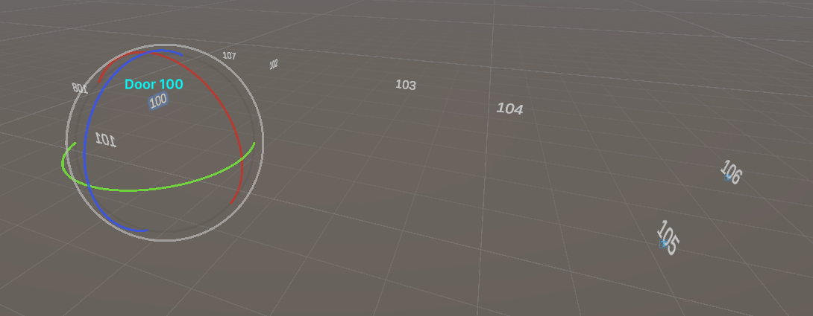
*Organized DoorIdentifiers under a parent*

> **Tip:** You can batch-create DoorIdentifiers for many doors at once using a simple editor script.

---

## Part 6: Player Setup

The player needs to be able to trigger doors.

### Step 6.1: Add DoorTriggerableAuthoring

1. Select your **Player** GameObject (the one with the CharacterController or Rigidbody)
2. Add the **DoorTriggerableAuthoring** component
3. Set the Player's **Layer** to match the door's **Can Open Layer Mask**

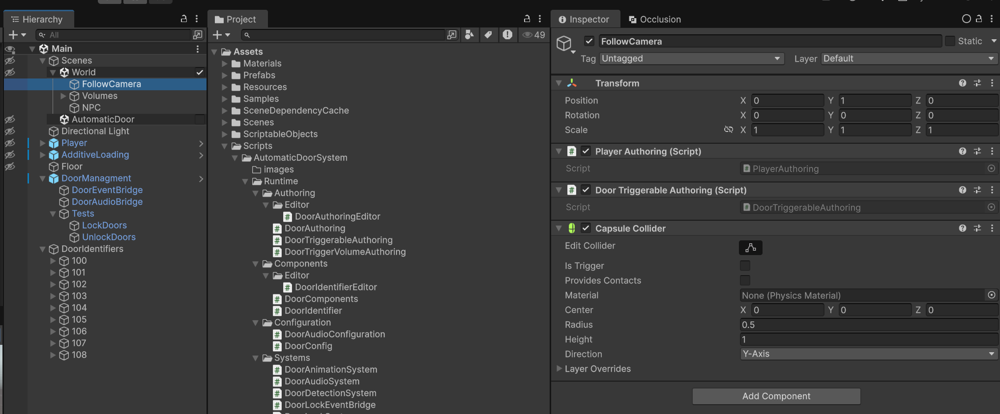
*Player with DoorTriggerableAuthoring component*

### Step 6.2: Verify Player Layer

1. Check your Player's layer (top-right of Inspector)
2. Ensure your DoorConfig's **Can Open Layer Mask** includes this layer

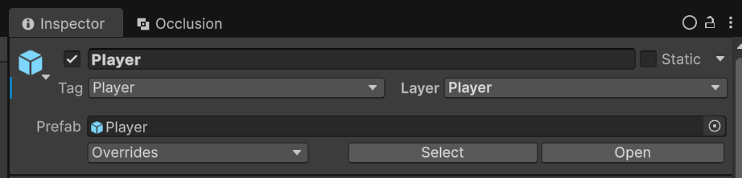
*Checking player layer matches DoorConfig layer mask*

### Step 6.3: Verify Camera.main

The pooling system uses **Camera.main** for distance calculations.

1. Ensure your main camera has the **MainCamera** tag
2. Or ensure it's the first enabled camera in the scene

---

## Part 7: Audio Configuration (Optional)

### Step 7.1: Create Audio Configuration Asset

1. Right-click in Project > **Create > Automatic Door System > Door Audio Configuration**
2. Name it (e.g., `DoorAudio_Wood`)


*Creating a Door Audio Configuration*

### Step 7.2: Configure Audio Settings

| Setting | Description |
|---------|-------------|
| **Volume** | Master volume (0-1) |
| **Spatial Blend** | 0 = 2D, 1 = 3D |
| **Min/Max Distance** | 3D audio rolloff range |
| **Open Sound Clips** | Array of sounds for opening |
| **Close Sound Clips** | Array of sounds for closing |
| **Lock/Unlock Sound Clips** | Sounds for lock events |

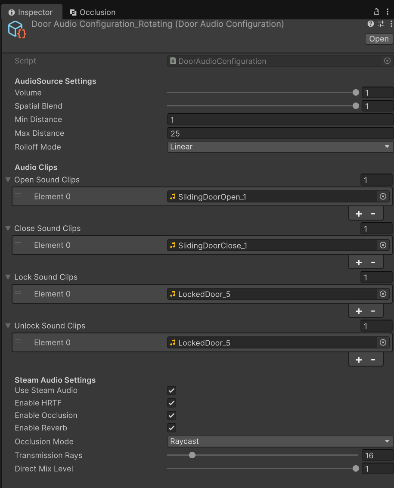
*Door Audio Configuration with sound clips assigned*

### Step 7.3: Assign to DoorIdentifier

1. Select your DoorIdentifier
2. Drag the Audio Configuration asset to the **Audio Configuration** field

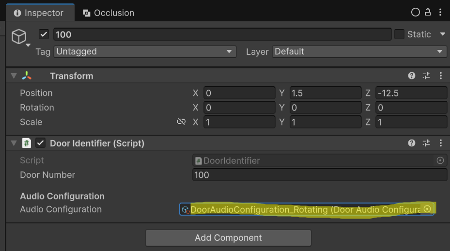
*Assigning audio configuration to DoorIdentifier*

---

## Troubleshooting

### Doors don't open when player approaches

1. **Check Player has DoorTriggerableAuthoring** component
2. **Check Player layer** matches DoorConfig's Can Open Layer Mask
3. **Check TriggerVolume size** is large enough
4. **Check subscene is closed** (baked to ECS)

### Door colliders not working

1. **Check BoxColliders exist** on door meshes in prefab
2. **Check BoxColliderPoolManager** exists in Main Scene
3. **Check Culling Distance** is large enough

### No door sounds playing

1. **Check AudioSourcePoolManager** exists in Main Scene
2. **Check DoorIdentifier** has matching Door Number
3. **Check Audio Configuration** has sound clips assigned
4. **Check Camera.main** exists (tagged MainCamera)

### Door ID mismatch warning

- Ensure **DoorAuthoring.doorId** matches **DoorIdentifier.doorNumber** exactly

---

## Screenshots to Take

Save screenshots with these exact names in an `images/` folder next to this README:

| Filename | What to Capture |
|----------|-----------------|
| `01_create_doorconfig.png` | Right-click menu showing Create > AutomaticDoorSystem > DoorConfig |
| `02_doorconfig_inspector.png` | DoorConfig asset selected, showing all Inspector settings |
| `03_door_hierarchy.png` | Door prefab hierarchy (Root > DoorMeshes > TriggerVolume) |
| `04_doorauthoring_inspector.png` | DoorAuthoring component with all fields configured |
| `05_door_collider_setup.png` | BoxCollider on door mesh in Inspector with Edit Collider active |
| `06_collider_gizmo_scene.png` | Scene view showing green BoxCollider wireframes on doors |
| `07_triggervolume_inspector.png` | DoorTriggerVolumeAuthoring component settings |
| `08_triggervolume_gizmo.png` | Scene view showing green trigger volume wireframe |
| `09_create_subscene.png` | GameObject menu showing New Sub Scene option |
| `10_door_in_subscene.png` | Door prefab inside open subscene in Hierarchy |
| `11_unique_door_ids.png` | Multiple doors selected showing different Door IDs |
| `12_doormanagement_create.png` | DoorManagement empty GameObject in Main Scene |
| `13_boxcolliderpoolmanager.png` | BoxColliderPoolManager component with all settings |
| `14_audiosourcepoolmanager.png` | AudioSourcePoolManager component with all settings |
| `15_doordatabridge.png` | DoorDataBridge component (simple, no settings) |
| `16_dooraudiobridge.png` | DoorAudioBridge component (simple, no settings) |
| `17_doormanagement_complete.png` | DoorManagement with all 4 components visible |
| `18_dooridentifier_create.png` | DoorIdentifier empty GameObject in Main Scene |
| `19_dooridentifier_inspector.png` | DoorIdentifier component showing Door Number field |
| `20_dooridentifiers_organized.png` | Multiple DoorIdentifiers organized under parent |
| `21_player_triggerable.png` | Player with DoorTriggerableAuthoring component |
| `22_player_layer_check.png` | Player Inspector showing layer, DoorConfig showing mask |
| `23_create_audioconfig.png` | Right-click menu showing Create audio config option |
| `24_audioconfig_inspector.png` | DoorAudioConfiguration with clips assigned |
| `25_assign_audioconfig.png` | DoorIdentifier with audio config assigned |

---

## Quick Reference Checklist

### Per Door Prefab:
- [ ] Root has **DoorAuthoring** with DoorConfig assigned
- [ ] Door meshes have **BoxCollider** sized to fit
- [ ] TriggerVolume has **DoorTriggerVolumeAuthoring**
- [ ] Meshes assigned in DoorAuthoring (single or left/right)

### Per Door Instance (in Subscene):
- [ ] **Unique Door ID** set in DoorAuthoring

### Main Scene (once):
- [ ] **DoorManagement** GameObject exists
- [ ] Has **BoxColliderPoolManager**
- [ ] Has **AudioSourcePoolManager**
- [ ] Has **DoorDataBridge**
- [ ] Has **DoorAudioBridge**

### Per Door (in Main Scene):
- [ ] **DoorIdentifier** with matching Door Number
- [ ] Optional: Audio Configuration assigned

### Player (once):
- [ ] Has **DoorTriggerableAuthoring**
- [ ] Layer matches DoorConfig's Can Open Layer Mask
- [ ] Main Camera has **MainCamera** tag
