# Automatic Door System - Setup Guide

A high-performance automatic door system using Unity ECS (Entities) with pooled audio and colliders for optimal performance with hundreds of doors.

---

## Table of Contents

1. [System Overview](#system-overview)
2. [Prerequisites](#prerequisites)
3. [Setup Validator](#setup-validator)
4. [Part 1: Creating Door Configurations](#part-1-creating-door-configurations)
5. [Part 2: Setting Up Door Prefabs](#part-2-setting-up-door-prefabs)
6. [Part 3: Adding Doors to Subscenes](#part-3-adding-doors-to-subscenes)
7. [Part 4: Main Scene Setup](#part-4-main-scene-setup)
8. [Part 5: Player Setup](#part-5-player-setup)
9. [Part 6: Audio Configuration](#part-6-audio-configuration)
10. [Migrating from 1.x](#migrating-from-1x)
11. [Troubleshooting](#troubleshooting)

---

## System Overview

This door system uses:
- **Unity ECS** for efficient door state management and animation
- **Subscenes** for doors (better loading performance)
- **Object pooling** for audio sources and colliders (handles hundreds of doors)
- **Distance-based culling** to only activate nearby doors

### Architecture Diagram

```
SUBSCENE (baked to entities)            MAIN SCENE (MonoBehaviour world)
+-------------------------------+       +----------------------------------+
| Door Prefab                   |       | DoorManagement                   |
| - DoorAuthoring               |       | - DoorDataBridge                 |
|   - doorId                    |       | - DoorAudioBridge                |
|   - DoorConfig (SO)           | ----> | - BoxColliderPoolManager         |
|   - DoorAudioConfiguration(SO)|       | - AudioSourcePoolManager         |
| - Door Meshes + BoxColliders  |       +----------------------------------+
| - TriggerVolume               |
|                               |
| Player object                 |
| - PlayerAuthoring (follows    |
|   Camera.main at runtime)     |
| - DoorTriggerableAuthoring    |
+-------------------------------+
```

Everything a door needs is authored on **DoorAuthoring** and baked into the door entity,
including its audio configuration. The main scene only holds the four manager components;
there is nothing to mirror per door.

> **Note for 1.x users:** audio configuration used to live on a `DoorIdentifier` GameObject
> in the main scene. That component is obsolete - see [Migrating from 1.x](#migrating-from-1x).

---

## Prerequisites

- Unity 6000.0 or newer
- Entities package installed
- Basic understanding of Unity's Subscene system

---

## Setup Validator

Before working through the setup by hand, open:

**Tools > AutomaticDoorSystem > Setup Validator**

It checks the loaded scenes and reports, with one-click fixes where possible:

- the four manager components in the main scene (and whether any of them ended up inside a subscene, where they would never run)
- `Camera.main`, which both pools cull against
- the player's `DoorTriggerableAuthoring` and whether its layer is allowed by the door configs
- per door: missing `DoorConfig`, missing meshes, missing trigger volume, missing panel BoxColliders
- **duplicate Door Ids**, the most common cause of doors silently losing their collider and sound
- leftover `DoorIdentifier` objects from 1.x, with a migrate-and-delete button

It also creates the assets a fresh project needs, asking where to save each one:
a full set of `DoorConfig` assets (all four door types), a `DoorAudioConfiguration`, and a
pooled AudioSource prefab.

Door checks only cover **open** subscenes - the validator lists any closed ones and offers to open them.

---

## Part 1: Creating Door Configurations

Door configurations are **ScriptableObjects** that define how a door behaves. Multiple doors can share the same configuration.

### Step 1.1: Create a DoorConfig Asset

1. In the **Project** window, right-click in your desired folder
2. Select **Create > AutomaticDoorSystem > DoorConfig**
3. Name it descriptively (e.g., `DoorConfig_DoubleRotating_90deg`)

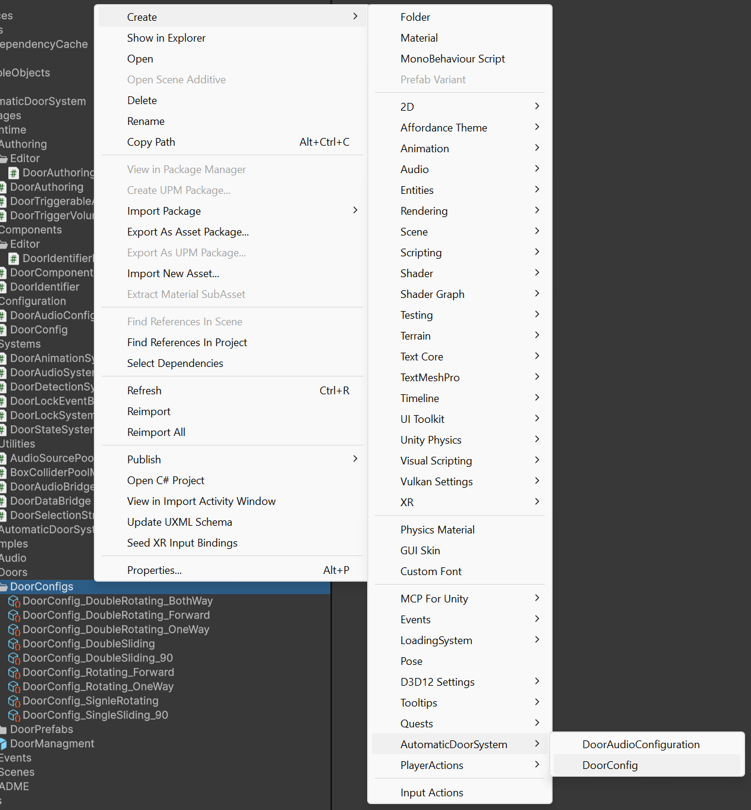
*Right-click > Create > AutomaticDoorSystem > DoorConfig*

### Step 1.2: Configure the DoorConfig

Select your new DoorConfig and configure it in the Inspector:

| Setting | Description | Recommended Values |
|---------|-------------|-------------------|
| **Door Movement** | `Rotating` or `Sliding` | Choose based on door type |
| **Door Count** | `Single` or `Double` | Single = 1 panel, Double = 2 panels |
| **Opening Style** | How double doors open | `Forward` (both away from player) |
| **Open Forward Angle** | Rotation when opening forward | `90` |
| **Open Backward Angle** | Rotation when opening backward | `-90` |
| **Slide Open Offset** | Distance to slide (sliding doors) | `(1.5, 0, 0)` |
| **Animation Duration** | How fast the door opens/closes | `1.0` - `1.5` seconds |
| **Auto Close Delay** | Time before auto-closing | `3.0` seconds |
| **Can Open Layer Mask** | Which layers can trigger doors | Select `Player` layer |
| **Start Locked** | Should door start locked? | Usually `false` |

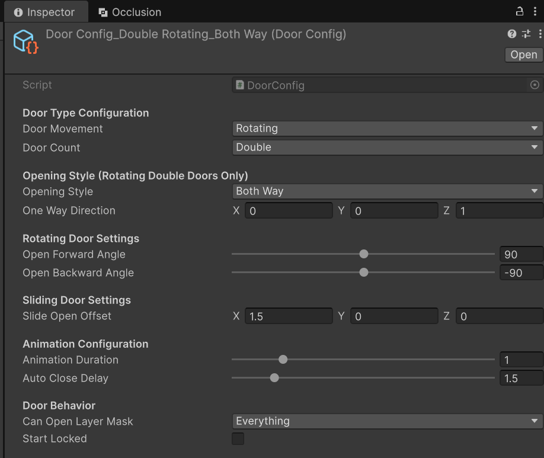
*DoorConfig Inspector with all settings visible*

---

## Part 2: Setting Up Door Prefabs

### Step 2.1: Create the Door Hierarchy

Create a new prefab with this exact hierarchy structure:

```
Door_DoubleRotating          <- Root GameObject (DoorAuthoring goes here)
  ├── LeftDoorMesh           <- Left door panel (mesh + BoxCollider)
  ├── RightDoorMesh          <- Right door panel (mesh + BoxCollider)
  └── TriggerVolume          <- Detection zone (DoorTriggerVolumeAuthoring)
```

For **single doors**, use this structure instead:
```
Door_SingleRotating          <- Root GameObject (DoorAuthoring goes here)
  ├── DoorMesh               <- Door panel (mesh + BoxCollider)
  └── TriggerVolume          <- Detection zone
```

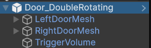
*Door prefab hierarchy in the Hierarchy window*

### Step 2.2: Set Up the Root GameObject

1. Select the root GameObject (e.g., `Door_DoubleRotating`)
2. Click **Add Component** and add **DoorAuthoring**
3. Configure the DoorAuthoring component:

| Field | What to Assign |
|-------|---------------|
| **Door Id** | Unique number for this door (e.g., `1`, `2`, `3`...) |
| **Door Mesh** | (Single doors only) Drag your DoorMesh here |
| **Left Door Mesh** | (Double doors) Drag LeftDoorMesh here |
| **Right Door Mesh** | (Double doors) Drag RightDoorMesh here |
| **Trigger Volume Object** | Drag TriggerVolume GameObject here |
| **Door Config** | Drag your DoorConfig asset here |
| **Door Audio Config** | Drag a DoorAudioConfiguration asset here (leave empty for a silent door) |
| **Enable Debug** | Check for gizmo visualization |

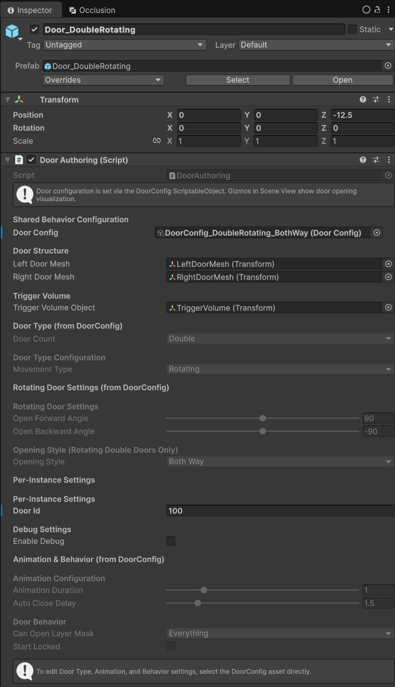
*DoorAuthoring component configured for a double door*

### Step 2.3: Add BoxColliders to Door Meshes

**Important:** BoxColliders on door meshes are essential for player collision!

1. Select each door mesh (e.g., `LeftDoorMesh`)
2. Click **Add Component > BoxCollider**
3. Adjust the collider to match your door's visual size:
   - Click **Edit Collider** button in the Inspector
   - Drag the green handles to fit the door mesh
   - Or manually set **Size** and **Center** values

**Typical values for a standard door:**
- **Size:** `(1.0, 2.2, 0.08)` (width, height, thickness)
- **Center:** `(0.5, 1.1, 0)` (offset from pivot)

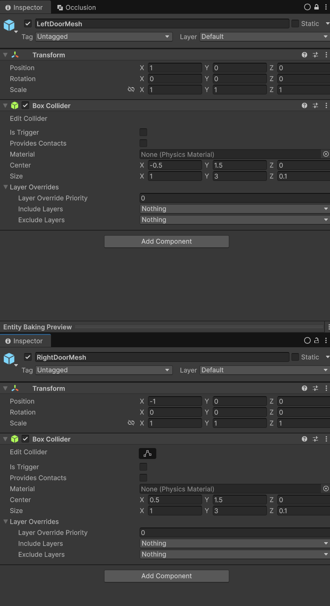
*BoxCollider on LeftDoorMesh with Edit Collider mode active*

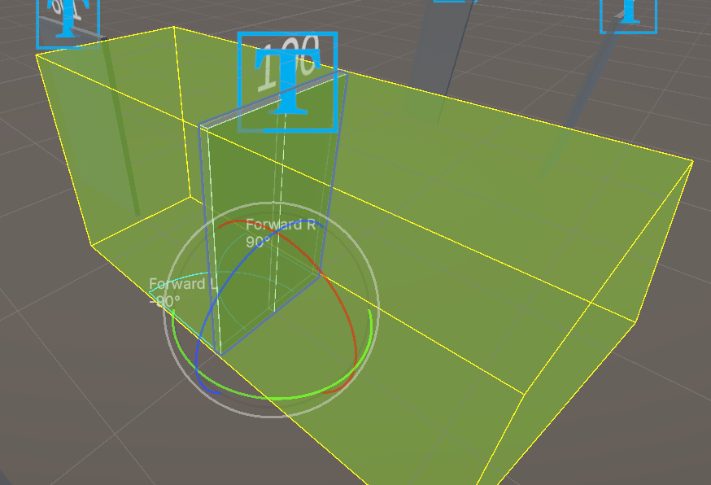
*Scene view showing the green BoxCollider outline on door meshes*

> **Note:** These colliders won't work directly in subscenes for physics. The system extracts their size/center during baking and applies them to pooled colliders at runtime.

### Step 2.4: Set Up the Trigger Volume

1. Select the `TriggerVolume` child GameObject
2. Add the **DoorTriggerVolumeAuthoring** component
3. Configure the detection zone:

| Field | Description | Recommended Value |
|-------|-------------|-------------------|
| **Volume Size** | Size of the trigger box | `(3.5, 3.0, 3.5)` |
| **Volume Center** | Center offset | `(0, 1.5, 0)` |

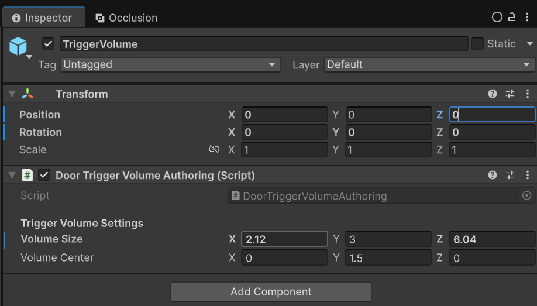
*DoorTriggerVolumeAuthoring component settings*

The trigger volume appears as a **green wireframe box** when either the TriggerVolume object or
the door root is selected in the Scene view, along with three markers:

| Marker | Colour | Meaning |
|--------|--------|---------|
| **Bottom center** | orange | Lowest point the volume reaches - raise it above the floor and nothing will trigger the door |
| **Top center** | cyan | Highest point the volume reaches - it has to clear the player's camera height |
| **Audio anchor** | yellow | Volume centre, where the pooled AudioSource is parked. Put it mid-doorway rather than at the door's hinge. To place the sound somewhere else entirely, assign a child Transform to the **Audio Anchor** field on DoorAuthoring - it then overrides the volume centre |

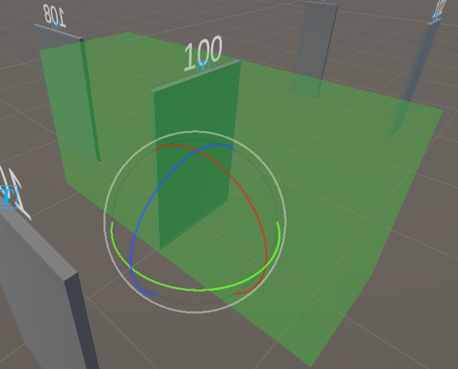
*Scene view showing the trigger volume gizmo*

### Step 2.5: Save the Prefab

1. Drag the root GameObject from Hierarchy to your **Project** window
2. Save it in a folder like `Assets/Prefabs/Doors/`
3. Name it clearly (e.g., `Door_DoubleRotating.prefab`)

---

## Part 3: Adding Doors to Subscenes

### Step 3.1: Create or Open a Subscene

1. In your scene, select **GameObject > New Sub Scene > Empty Sub Scene**
2. Name it (e.g., `Subscene_Building1_Doors`)
3. The subscene appears in the Hierarchy with a special icon

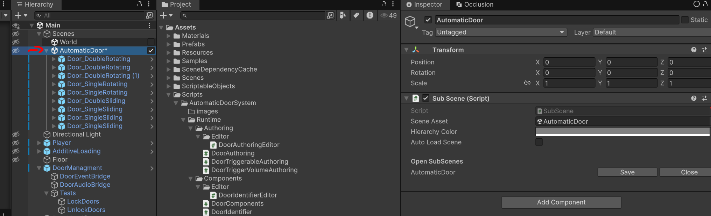
*Creating a new subscene*

### Step 3.2: Add Door Prefabs to the Subscene

1. **Double-click** the subscene to open it for editing (or right-click > Open)
2. Drag your door prefab from the Project window into the subscene
3. Position the door in your scene
4. **Important:** Set a unique **Door Id** for each door instance

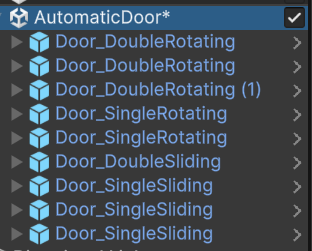
*Door prefab placed inside an open subscene*

### Step 3.3: Assign Unique Door IDs

Each door **must have a unique Door ID**. It keys the collider pool, the audio pool and the
lock/unlock events, so two doors sharing an ID means all but one of them silently loses its
collider and its sound.

1. Select the door in the subscene
2. In the DoorAuthoring component, set **Door Id** to a unique number

> Dropped several door prefabs in without touching this? They all sit on the default `0`.
> **Tools > AutomaticDoorSystem > Setup Validator** finds every duplicate and renumbers them for you.

| Door | Door ID |
|------|---------|
| Entrance Door | 1 |
| Office Door | 2 |
| Storage Door | 3 |
| ... | ... |


*Multiple doors with unique Door IDs*

### Step 3.4: Close the Subscene

1. Right-click the subscene in Hierarchy
2. Select **Close**
3. The subscene will bake and convert to ECS entities

---

## Part 4: Main Scene Setup

The Main Scene contains the **DoorManagement** system that handles pooled resources.

### Step 4.1: Create the DoorManagement GameObject

1. In your **Main Scene** (not a subscene), create an empty GameObject
2. Name it `DoorManagement`
3. Position it at `(0, 0, 0)` - position doesn't matter, but keep it organized


*DoorManagement GameObject in the Main Scene hierarchy*

### Step 4.2: Add Required Components

Add these four components to the DoorManagement GameObject:

#### Component 1: BoxColliderPoolManager

**Purpose:** Creates pooled BoxColliders that follow door panels for physics collision.

| Setting | Description | Recommended Value |
|---------|-------------|-------------------|
| **Max Pool Size** | Maximum active colliders | `25` |
| **Culling Distance** | Range to activate colliders | `25` meters |
| **Distance Check Interval** | How often to update | `0.5` seconds |
| **Minimum Spacing** | Prevent duplicate colliders | `0.5` meters |
| **Reassignment Threshold** | Hysteresis for stability | `1.3` |
| **Keep Out Of Range Assignments** | Reduce reassignments | `true` |

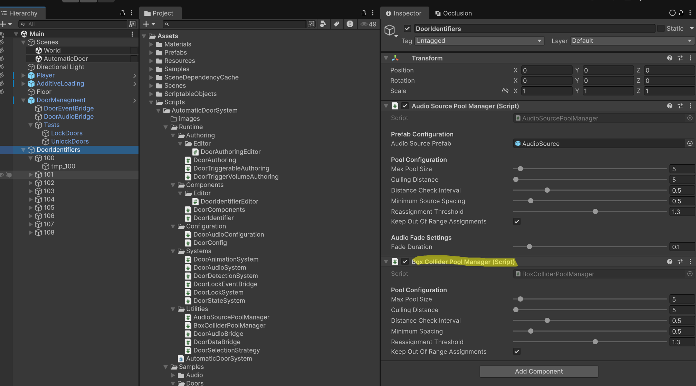
*BoxColliderPoolManager component settings*

#### Component 2: AudioSourcePoolManager

**Purpose:** Creates pooled AudioSources for door sounds (open, close, lock, unlock).

| Setting | Description | Recommended Value |
|---------|-------------|-------------------|
| **Audio Source Prefab** | Optional custom prefab | Leave empty for default |
| **Max Pool Size** | Maximum active audio sources | `25` |
| **Culling Distance** | Range to activate audio | `25` meters |
| **Distance Check Interval** | How often to update | `0.5` seconds |
| **Minimum Source Spacing** | Prevent overlapping sounds | `0.5` meters |
| **Reassignment Threshold** | Hysteresis for stability | `1.3` |
| **Keep Out Of Range Assignments** | Reduce reassignments | `true` |
| **Fade Duration** | Volume fade time | `0.1` seconds |

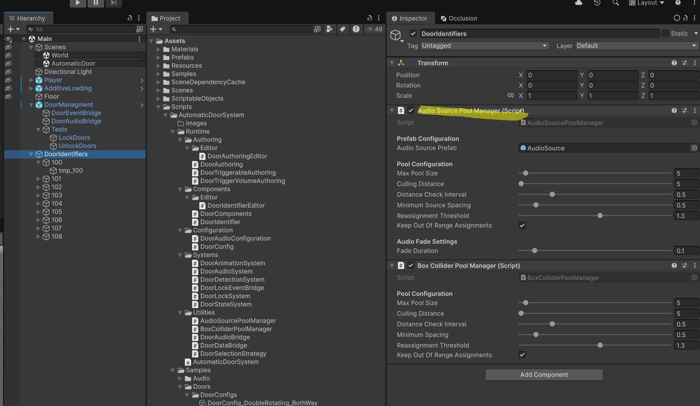
*AudioSourcePoolManager component settings*

#### Component 3: DoorDataBridge

**Purpose:** Bridges data between ECS doors and MonoBehaviour world. Caches door positions and states.

This component has no visible settings - just add it.

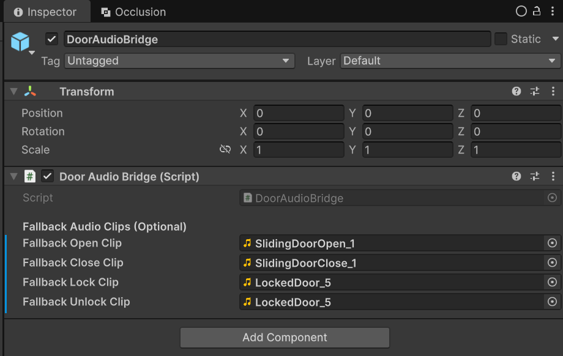
*DoorDataBridge component (no settings)*

#### Component 4: DoorAudioBridge

**Purpose:** Routes audio events from ECS to the pooled AudioSources.

This component has no visible settings - just add it.

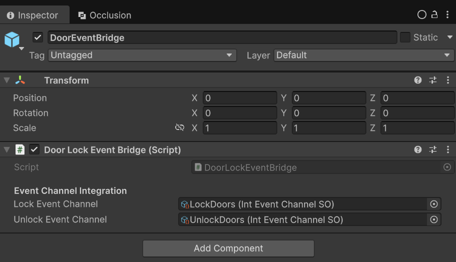
*DoorAudioBridge component (no settings)*

### Step 4.3: Verify DoorManagement Setup

Your DoorManagement GameObject should now have all 4 components:

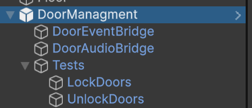
*Complete DoorManagement setup with all 4 components*

---

## Part 5: Player Setup

Door detection runs entirely in ECS: it only reacts to **entities** that carry
`DoorTriggerableTag`. That tag comes from baking `DoorTriggerableAuthoring`, so the component
has to sit on a GameObject **inside a subscene** - one added to the main scene is never baked
and will never open a door.

### Step 5.1: Add DoorTriggerableAuthoring to the player proxy

In the world subscene, find (or create) the GameObject carrying **PlayerAuthoring**
(from `fr.jeanf.scenemanagement`). That object bakes into an entity which follows `Camera.main`
every frame, so it stands in for the real player rig that lives in the main scene.

1. Select that GameObject inside the **subscene**
2. Add the **DoorTriggerableAuthoring** component

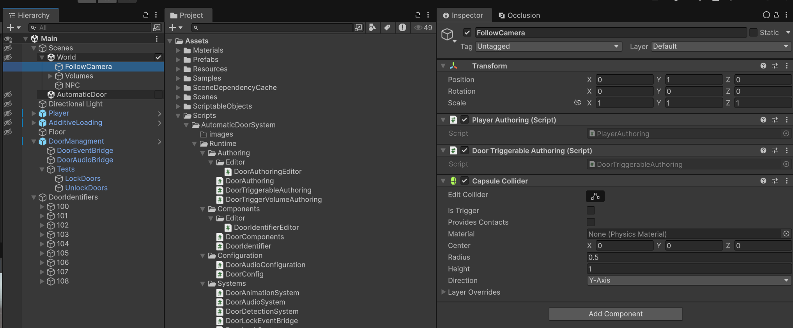
*Player proxy with DoorTriggerableAuthoring component*

> Other entities can open doors too - add `DoorTriggerableAuthoring` to any baked NPC or vehicle.
> Only the player proxy needs `PlayerAuthoring`.

### Step 5.2: Verify the layer

1. Check the layer of the object you just added the component to
2. Ensure every DoorConfig's **Can Open Layer Mask** includes that layer

The Setup Validator reports any DoorConfig that excludes it, and can add the layer for you.

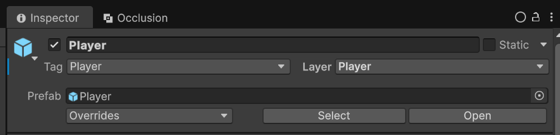
*Checking player layer matches DoorConfig layer mask*

### Step 5.3: Verify Camera.main

Both pools cull by distance to **Camera.main**, and the player proxy entity follows it.

1. Ensure your main camera has the **MainCamera** tag
2. Or ensure it's the first enabled camera in the scene

---

## Part 6: Audio Configuration

Audio is configured per door on **DoorAuthoring** and baked into the door entity. At runtime the
`AudioSourcePoolManager` parks one of its pooled AudioSources at the **centre of the door's
trigger volume** and hands it the configuration - nothing has to be mirrored in the main scene.

### Step 6.1: Create an Audio Configuration Asset

1. Right-click in Project > **Create > AutomaticDoorSystem > DoorAudioConfiguration**
   (or use the Setup Validator's create button)
2. Name it (e.g., `DoorAudio_Wood`)

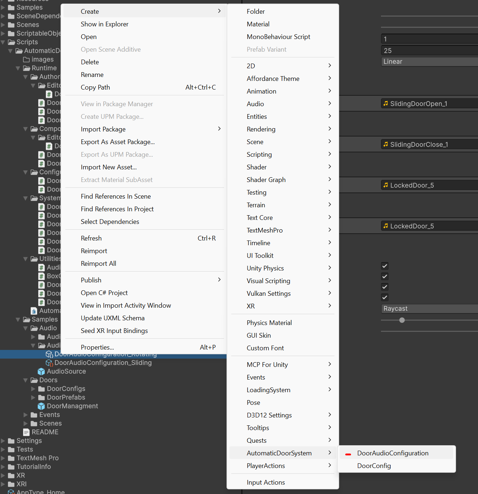
*Creating a Door Audio Configuration*

### Step 6.2: Configure Audio Settings

| Setting | Description |
|---------|-------------|
| **Volume** | Master volume (0-1) |
| **Spatial Blend** | 0 = 2D, 1 = 3D |
| **Min/Max Distance** | 3D audio rolloff range |
| **Open Sound Clips** | Array of sounds for opening |
| **Close Sound Clips** | Array of sounds for closing |
| **Lock/Unlock Sound Clips** | Sounds for lock events |
| **Steam Audio sections** | Applied to the pooled SteamAudioSource, if the prefab has one |

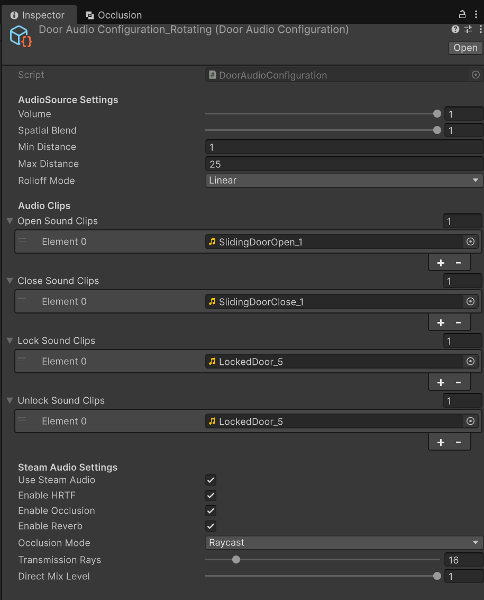
*Door Audio Configuration with sound clips assigned*

### Step 6.3: Assign to the Door

1. Select the door in the subscene
2. Drag the asset onto **Door Audio Config** on the DoorAuthoring component
3. Close the subscene so it rebakes

Doors sharing a material or size normally share one configuration asset.

### Step 6.4: Optional - a pooled AudioSource prefab

By default the pool creates bare AudioSources. Assign an **Audio Source Prefab** on the
`AudioSourcePoolManager` to control what gets pooled - most importantly to include a
`SteamAudioSource` so door sounds get Steam Audio spatialization. The Setup Validator can
create and assign a suitable prefab.

---

## Migrating from 1.x

In 1.x, each door needed a matching `DoorIdentifier` GameObject in the main scene to carry its
audio configuration, because `DoorAuthoring` does not exist at runtime once a subscene is baked.
2.0 bakes the configuration into the door entity as a `UnityObjectRef`, so those objects are gone.

`DoorIdentifier` still compiles - so old scenes open without missing-script errors - but it does
nothing at runtime and will be removed in a future release.

To migrate:

1. Open the subscene(s) holding the doors, so the validator can match Door Ids
2. **Tools > AutomaticDoorSystem > Setup Validator**
3. Under *Legacy DoorIdentifier objects*, press **Migrate and delete**

That copies each `audioConfiguration` onto the DoorAuthoring with the matching `doorId`, then
deletes the leftover objects. DoorIdentifiers whose door is in a closed subscene are left alone
so nothing is lost - open that subscene and run it again.

Finally, **close and reopen the subscenes** so the doors rebake with the audio reference.

## Troubleshooting

### Doors don't open when player approaches

1. **Check Player has DoorTriggerableAuthoring** component
2. **Check Player layer** matches DoorConfig's Can Open Layer Mask
3. **Check TriggerVolume size** is large enough
4. **Check subscene is closed** (baked to ECS)

### Door colliders not working

1. **Check BoxColliders exist** on door meshes in prefab
2. **Check BoxColliderPoolManager** exists in Main Scene
3. **Check Culling Distance** is large enough

### No door sounds playing

1. **Check the door has a Door Audio Config** on its DoorAuthoring, with clips assigned
2. **Check the subscene was rebaked** after assigning it (close and reopen the subscene)
3. **Check AudioSourcePoolManager and DoorAudioBridge** exist in the Main Scene
4. **Check Camera.main** exists (tagged MainCamera)
5. **Check for duplicate Door Ids** - a duplicate keeps its door out of the audio pool

### "An item with the same key has already been added: N"

Two or more doors share Door Id `N`. Run the Setup Validator and press **Assign unique Door Ids**.
(2.0 also stopped throwing here - the duplicate is now dropped with an explanatory error instead.)

### Doors moved/rotated and the trigger volume looks off

The trigger volume centre is stored relative to the door root and is now transformed by the door's
full rotation and scale. If a rotated door's detection zone was tuned against the 1.x behaviour
(which ignored rotation), re-check its **Volume Center** using the gizmo markers.

---

## Quick Reference Checklist

> All of this is checked by **Tools > AutomaticDoorSystem > Setup Validator**.

### Per Door Prefab:
- [ ] Root has **DoorAuthoring** with DoorConfig assigned
- [ ] Door meshes have **BoxCollider** sized to fit
- [ ] TriggerVolume has **DoorTriggerVolumeAuthoring**, assigned to **Trigger Volume Object**
- [ ] Meshes assigned in DoorAuthoring (single or left/right)

### Per Door Instance (in Subscene):
- [ ] **Unique Door ID** set in DoorAuthoring
- [ ] **Door Audio Config** assigned (unless the door is meant to be silent)

### Main Scene (once):
- [ ] **DoorManagement** GameObject exists
- [ ] Has **BoxColliderPoolManager**
- [ ] Has **AudioSourcePoolManager**
- [ ] Has **DoorDataBridge**
- [ ] Has **DoorAudioBridge**
- [ ] Optional: **Audio Source Prefab** assigned for Steam Audio spatialization

### Player (once):
- [ ] Player proxy **inside the world subscene** has **DoorTriggerableAuthoring**
- [ ] That object also has **PlayerAuthoring** so it follows Camera.main
- [ ] Its layer is included in every DoorConfig's Can Open Layer Mask
- [ ] Main Camera has **MainCamera** tag
